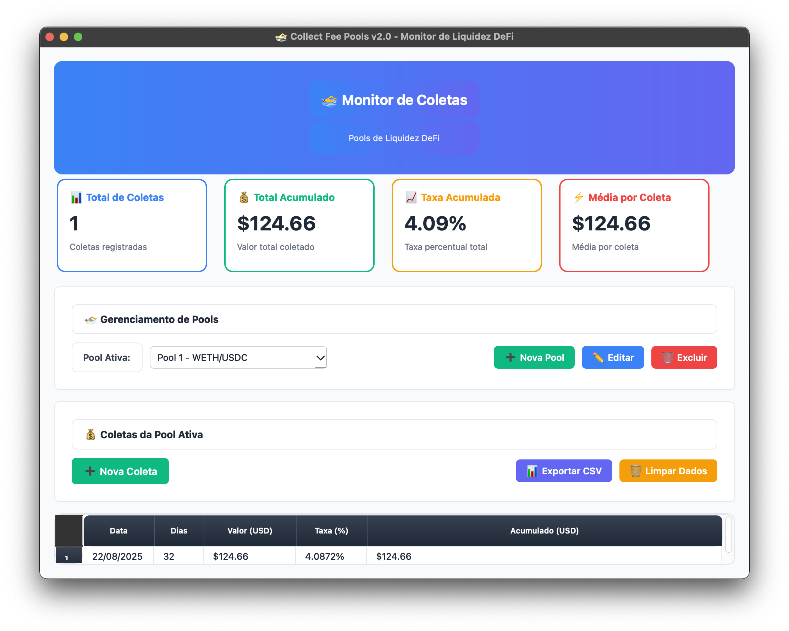

# collect-fee-pools

Aplicativo desktop moderno em Python para monitorar coletas de taxas em pools de liquidez DeFi com interface gráfica intuitiva — construído com PySide6 e com suporte a executáveis nativos para macOS e Windows.

## Funcionalidades

- **Gerenciamento de pools**:
  - Criar pools ilimitadas com configurações específicas (nome, par de tokens, valor inicial)
  - Editar e excluir pools com confirmação de segurança
  - Alternar entre pools via dropdown moderno

- **Monitoramento de Coletas**:
  - Registrar coletas com data e valor automaticamente
  - Calcular percentuais de taxas com base no valor inicial
  - Mostrar totais acumulados por pool e histórico completo

- **Interface moderna**:
  - Design clean com dropdown intuitivo
  - Tipografia otimizada, layout responsivo, botões com ícones

- **Gestão de dados**:
  - Persistência automática em arquivos CSV por pool
  - Migração automática de dados antigos
  - Exportação personalizada dos dados por pool

## Instalação

```bash
# Pré-requisitos
Python 3.13+
UV (gestor de pacotes Python)

# Instalar UV (se não tiver)
curl https://astral.sh/uv/install.sh | sh

# Instalação das dependências
uv sync
```

## Executando a aplicação

```bash
uv run main.py
```

## Gerar executável (macOS)

```bash
# Gerar binário
uv run build_final.py
```

## Como usar

1. Na primeira execução, a aplicação vai migrar dados antigos automaticamente.
2. Clique em “➕ Nova Pool” para criar sua primeira pool.
3. Registre coletas, visualize totais acumulados e acompanhe o histórico com facilidade.

---
